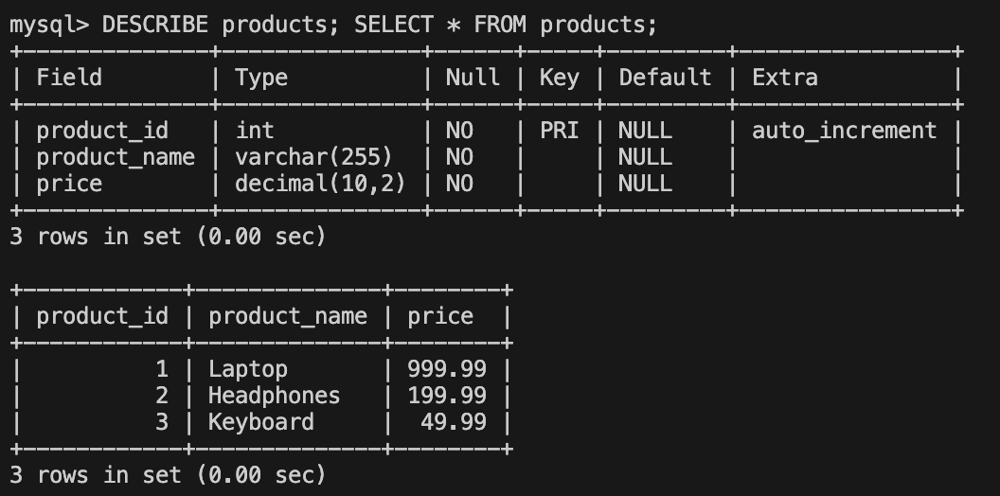

# IDS706 Complex SQL Query for a MySQL Database

## Continuous Integration with GitHub Actions
[](https://github.com/Reby0217/ids706-miniproj12/actions/workflows/install.yml)
[](https://github.com/Reby0217/ids706-miniproj12/actions/workflows/lint.yml)
[](https://github.com/Reby0217/ids706-miniproj12/actions/workflows/format.yml)
[](https://github.com/Reby0217/ids706-miniproj12/actions/workflows/test.yml)
[](https://github.com/Reby0217/ids706-miniproj12/actions/workflows/docker.yml)

This project focuses on designing, querying, and interacting with a MySQL database using Python. It features a CI/CD pipeline that automates the building of a Docker image, which is then pushed to Docker Hub. The database contains tables representing customers, products, and orders, and the SQL queries include complex operations such as joins, aggregations, and sorting to provide valuable insights into customer purchases and order histories.

---

## Docker Hub Integration

The Docker image for this project is automatically built through a CI/CD pipeline and pushed to Docker Hub, allowing users to pull and run the containerized application directly. Below are the instructions and a visual representation of the repository.

### **Image Pull Instructions**

1. **Pull the Docker Image**:  
   To pull the image from Docker Hub, use the following command:  
   ```bash
   docker pull pika0217/ids706-miniproj12:latest
   ```

2. **Run the Docker Container**:  
   Once the image is pulled, you can run it using:  
   ```bash
   docker run -it --rm --network="host" pika0217/ids706-miniproj12:latest
   ```

### **Docker Hub Repository**

Below is a screenshot of the Docker Hub repository showing the hosted image and available tags:


---

## Getting Started

### Prerequisites

- Python 3.9+
- `pip` for managing dependencies

### Installation

1. Clone the repository:

   ```bash
   git clone https://github.com/Reby0217/ids706-miniproj12.git
   cd ids706-miniproj12
   ```

2. Run all setup steps in one command:

   ```bash
   make all
   ```

This single command will:
- Install dependencies.
- Create and activate a virtual environment.
- Format and lint the code.
- Run the tests.
- Execute the main Python script.

---

## Running MySQL in Docker

To run the MySQL database in a Docker container, follow these steps:

1. **Run MySQL in Docker**:
   ```bash
   docker run --name mysql-db -e MYSQL_ROOT_PASSWORD=qwer1234 -e MYSQL_DATABASE=ecommerce_db -p 3306:3306 -d mysql:8.0
   ```


## Running the Project in Docker

To run the project in a Docker container, follow these steps:

1. **Build the Docker Image**:
   ```bash
   make docker-build
   ```

2. **Run the Docker Container**:
   ```bash
   make docker-run
   ```

3. **Run Tests in Docker**:
   ```bash
   make docker-test
   ```

### Docker


---

## Accessing MySQL in Docker

To access the MySQL client inside your running MySQL container:

```bash
docker exec -it mysql-db mysql -u root -p
```

Once you're inside the MySQL client, you can run queries to view the tables:

```sql
USE ecommerce_db;
DESCRIBE customers; SELECT * FROM customers;
DESCRIBE products; SELECT * FROM products;
DESCRIBE orders; SELECT * FROM orders;
```

### Tables





---

## Functionality

### SQL Query:
```sql
SELECT
    customers.customer_name,
    customers.customer_email,
    COUNT(orders.order_id) AS total_orders,
    COALESCE(SUM(orders.quantity * products.price), 0) AS total_spent,
    MAX(orders.order_date) AS last_order_date
FROM
    customers
LEFT JOIN
    orders ON customers.customer_id = orders.customer_id
LEFT JOIN
    products ON orders.product_id = products.product_id
GROUP BY
    customers.customer_id
ORDER BY
    total_spent DESC;
```

### Query Explanation:

The SQL query in `src/cli.py` retrieves aggregated customer details by joining the **customers**, **orders**, and **products** tables, providing information on:
- Total number of orders each customer has placed.
- The total amount each customer has spent.
- The last date when each customer placed an order.

1. **Joins**:
   - **LEFT JOIN**: Connects the `customers` table with the `orders` table on the `customer_id`. A left join ensures that every customer is included, even if they haven't placed any orders.
   - The second join connects the `orders` table with the `products` table, allowing access to product prices to calculate the total amount spent by each customer.

2. **Aggregation**:
   - **COUNT(orders.order_id)**: Counts the number of orders each customer has placed.
   - **SUM(orders.quantity * products.price)**: Multiplies the quantity of each ordered product by its price to calculate the total amount spent by the customer.
   - **MAX(orders.order_date)**: Retrieves the latest date on which the customer placed an order.

3. **Handling NULL values**:
   - **COALESCE(SUM(...), 0)**: Ensures that if a customer has not placed any orders, the result will show `$0` spent instead of `NULL`.

4. **Sorting**:
   - **ORDER BY total_spent DESC**: Sorts the customers in descending order based on how much they have spent, with the highest spender first.

### Expected Results:

The expected result is a list of customers showing their total number of orders, total amount spent, and the last order date. The data is sorted by the total amount spent, with the highest spender listed first:

```
Customer: John Doe (john@example.com)
Total Orders: 2
Total Spent: $1399.97
Last Order Date: 2023-09-16

Customer: Jane Smith (jane@example.com)
Total Orders: 1
Total Spent: $49.99
Last Order Date: 2023-09-17
```

- **John Doe** has placed 2 orders and spent $1399.97, with the last order on `2023-09-16`.
- **Jane Smith** has placed 1 order and spent $49.99, with the last order on `2023-09-17`.

---

## Makefile

The project uses a `Makefile` to streamline development tasks, including testing, formatting, linting, and installing dependencies. Key Makefile commands:

- **Install**: Upgrade `pip` and install project dependencies.
  ```bash
  make install
  ```
  
- **Setup**: Create and activate a virtual environment, ensuring the latest version of `pip` is installed.
  ```bash
  make setup
  ```

- **Format**: Automatically format all Python files with `black`.
  ```bash
  make format
  ```

- **Lint**: Check code quality using `ruff`.
  ```bash
  make lint
  ```

- **Test**: Run the unit tests for the project.
  ```bash
  make test
  ```

- **Run**: Execute the main Python script to interact with the database.
  ```bash
  make run
  ```

- **All**: Run the full suite of tasks—install, setup, lint, test, and format.
  ```bash
  make all
  ``` 